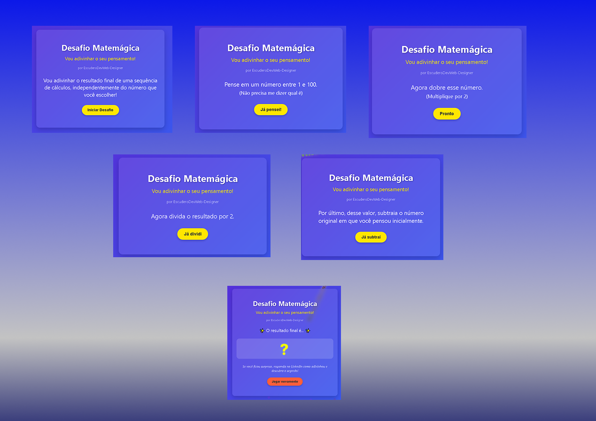

# 🧮 Desafio Matemágica 🔮


<!-- Substitua pelo seu screenshot -->


[🧮 Experimente o Desafio Matemágica Agora!](https://escudero03.github.io/JavaScript-Desafio-Matemagica/)


## 📝 Descrição

O **Desafio Matemágica** é um jogo interativo baseado em um truque matemático clássico. O jogo guia o usuário por uma série de operações matemáticas e, surpreendentemente, consegue prever o resultado final independentemente do número inicial escolhido pelo usuário!

Este projeto demonstra como princípios matemáticos simples podem ser transformados em uma experiência interativa e divertida usando HTML, CSS e JavaScript.

---

## 🎯 Funcionalidades

- ✨ Interface interativa e amigável
- 🎲 Gera valores aleatórios para cada rodada
- 🌈 Texto flutuante animado com efeito de gradiente
- 🎉 Animação de confetes quando revela o resultado
- 📱 Design responsivo (funciona em dispositivos móveis)
- 🔄 Possibilidade de jogar múltiplas vezes

---

## 🔧 Tecnologias Utilizadas

- **HTML5** - Estrutura da página
- **CSS3** - Estilização e animações visuais
- **JavaScript** - Lógica do jogo e animações dinâmicas
- **Gradientes CSS** - Efeitos visuais no background e texto
- **CSS Animations** - Animações de elementos na tela

---

## 🧩 Como Funciona

O truque matemático por trás do jogo segue este princípio:

1. O usuário pensa em um número `x`
2. Dobra o número: `2x`
3. Soma um valor aleatório: `2x + n` (n é um número par)
4. Divide por 2: `(2x + n)/2 = x + n/2`
5. Subtrai o número original: `x + n/2 - x = n/2`


---

## 💻 Como Executar

1. Clone este repositório:
   ```bash
   git clone https://github.com/seu-usuario/desafio-matemagica.git
   ```

2. Abra o arquivo `index.html` em seu navegador

3. Alternativa: Acesse a [versão online](https://seu-link-aqui.com)

---

## 🚀 Recursos Especiais

### 🌟 Nome Flutuante

Uma característica única deste projeto é o nome "EscuderoDevWeb-Designer" flutuando pela tela como uma bola de pingue-pongue:

- Rebate nas bordas da tela
- Muda de cor (gradiente) a cada colisão
- Rotaciona suavemente enquanto se move
- É renderizado com um gradiente de cores que muda dinamicamente

### 🎆 Efeito de Confetes

Quando o resultado é revelado, uma animação de confetes coloridos é disparada para celebrar!

---

## 🔍 Detalhes Técnicos

Os principais desafios técnicos do projeto foram:

- Implementação do efeito de rebatimento nas bordas para o texto flutuante
- Criação do sistema de gradientes dinâmicos que mudam a cada colisão
- Animação de confetes com física realista
- Garantir que a experiência fosse fluida em diferentes tamanhos de tela

---

## 🌱 Possíveis Melhorias Futuras

- [ ] Adicionar sons e efeitos sonoros
- [ ] Incluir mais truques matemágicos
- [ ] Implementar um sistema de pontuação
- [ ] Criar uma versão multiplayer

---

## 📄 Licença
Este projeto está sob a licença MIT. Veja o arquivo [LICENSE](LICENSE) para mais detalhes.

📝 Notas

👥 Agradeço sinceramente a oportunidade de compartilhar este projeto, que, embora simples, representa um marco significativo no meu aprendizado em desenvolvimento web. 
Reconheço que ainda tenho um longo caminho a percorrer e muito a aprender, mas estou comprometido em continuar me dedicando e aprimorando minhas habilidades. Este projeto foi 
desenvolvido para colocar em pratica  conhecimentos adquirido.

👨‍💻 Desenvolvido por ⭐️[Jose Escudero (um dev em aprendizado!).]⭐️ 😃

💖"DEV APRENDIZADO" - Porque cada linha de código é um passo adiante! 🚀

## 👨‍💻 Autor

**EscuderoDevWeb-Designer**

[](https://www.linkedin.com/in/escuderodevweb/)
[](https://github.com/Escudero03)
[](https://wa.me/5511985715512)

---

